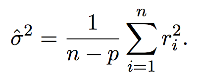
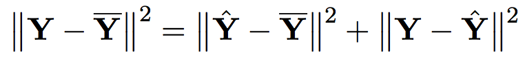
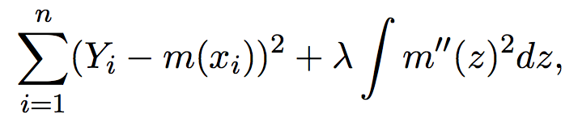
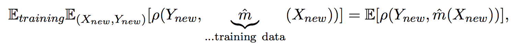
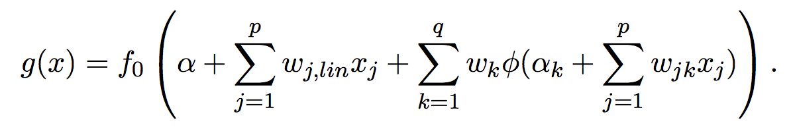
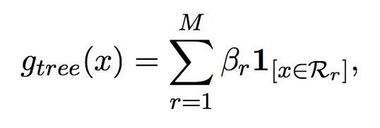

## Multiple Linear Regression

* Multiple linear regression: a linear of function of several predictors (or covaraibles)

  * Formula 
  * Assumptions: errors are **i.i.d.** with zero expectation and an unknown variance; n > p; X is of full rank.
  * Look for good estimates of $\beta$ in terms of least squares
  * Variance $\sigma^2$ can be estimated using 
  * Assumptions for the linear model so that least square estimator and test and confidence intervals are approximately valid:
    1. LR equation is correct;
    2. All predictors can be perfectly observed;
    3. Homoscedasticity for errors (var is constant);
    4. Errors are uncorrelated;
    5. Errors are jointly normally distritubed.
  * ZSD: when a matrix $P$ is sym.; idem-potent $P^2 = P$; and has trace equal to dim, then it's a orthogonal projection
  * Simple least squares regressions on single predictor variables yield the multiple regression least squares solution, only if the predictor variables are orthogonal.

* Tests and confidence regions

  * Use *ANOVA* decomposition to test whether there is any effect from predictor variables (instead of individual test), where $\hat Y$ is the mean of Y: more specifically, use F-test to compare mean square of regression and error respectively
  * 
  * **Coefficient of determination**: goodness of fit of the linear model for explaining the data

* Analysis of residuals and checking of model assumptions

  * The Tukey-Anscombe plot: residual against fitted values
    * Linear: log transformation for y
    * Non-linear: square root transformation for y if quadratic
    * Systematic: either transform the response variable or use weighted regression
  * The normal plot: a special case of QQ plot (quantile-quantile), empirical quantile of residuals versus theoretical quantile of normal distribution
  * Residuals versus observation number to detect serial correlation

* Generalized least squares: errors are correlated with known covariance matrix; using square root of covariance matrix to solve the problem

* Model selection

  * Mallows $C_p$ statistic where SSE is residual sum of squares and $\hat \sigma ^2$ error variance estimate: 
  * Forward selection
    1. Start with the smallest model
    2. Include the predictor that reduces most the residual sum of squares
    3. Until all predictors are selected or a large number of predictors
    4. Choose the model in the sequence with the smallest $C_p$ statistic

     ​

  ## Nonparametric Density Estimation

  *  Kernel estimator
    * Naive estimator
    * Typical kernel: gaussian, Epanechnikov (optimal w.r.t. mean squared error)

* Hyperparameter: bandwidth, which can be either global or local

  * IMSE (integrated mean squared error) 
  * 
  * Local and global optimal bandwidth (see p.p 20 - 22)


## Nonparametric Regression

* Nonparametric regression model, where noise is i.i.d. and centered, m is called nonparametric regression function satisfying $E[Y|X=x]$ 
* The kernel regression estimator
  * Nadaraya-Watson kernel estimator: plug univariate and bivariate kernel density into the conditional expectation 
  * Role of bandwidth
    * Similar to its role in nonparametric density estimation, we can deduce optimal local bandwidth
    * `library(lokern); lofit <- lokerns(cars$ speed, cars$ dist)`
* The **Hat Matrix S**: linear operator to map true Ys to fitted values
  * Degrees of freedom = tr(S)
* Local polynomial nonparametric regression estimator (**TBU**)
  * Extend to locally polynomial function from locally constant Nadaraya-Watson kernel estimator
* Smoothing splines and penalized regression
  * Penalized sum of squares, where large $\lambda$ gives a smooth function
  * The solution is a natural cubic spline with knots at the observed points, **see derivation**
  * Adaption to density of the predictor variables

## Cross-Validation

* Generalization performance
  * measures the predictive power of a learning method on new, out-sample data
  * generalization error: expected value of loss w.r.t training and test data, see (4.1)
    * Theoretical test error: 
    * Generalization error: 
* Leave-one-out CV
  * (4.2) is an estimate of generalization error
  * expensive due to retraining for every sample
* K-fold CV
  * Random partition is crucial to prevent missing information
  * Disadvantage: depends only on one realized random partition
* Leave-d-out CV
  * basic version: consider all subsets of d data points as test data
  * Also an **estimate** of generalization error
  * improvement using randomization: draw B random test subsets uniformly without replacement
    * implementation: a random test subset can be constructed by **sampling without replacement**, i.e., draw d times randomly without replacement from {1,2,…,n}
    * d = [10%*n], B = 50 - 500
    * can also be applied to LOO CV
    * possible drawback is that C_k may coincide
* K-fold CV
  * note: random partition is important to prevent missing information
* **Properties** of different CV- schemes
  * LOO: approx. unbiased for true generalization error; slight bias + high variance (due to high covariance caused by similar training set)
  * Leave-d-out: higher bias than LOO + less variance (even though we average over more highly correlated summands)
  * K-fold: higher bias + unclear variance
* Computational shortcut for some linear fitting operators
  * LOO score
    * when prediction on the training data points can be linearly represented by targets
    * compute the CV score by fitting the original estimator **once** on the **full** dataset (4.5) 
    * use GCV (generalized cross-validation) to approximate the (4.5) (use average value of diagonal elements computed through trace)


## Bootstrap

* Objective: to obtain the full distribution of the estimator since in general we can only otherwise derive aymptotic distribution whereas in other cases we even lack mathematical tools

* We use **empirical distribution** to generate **bootstrap samples** based on which we compute estimators, the process of which repeats many times to get an approximate distribution

* **Bootstrap distribution**: the distribution which arises when resampling with empirical distribution and applying the function g on such a bootstrap sample

* Bootstrap consistence

  * see (5.3)
  * consistency of the bootstrap (usually) implies consistent variance and bias estimation

* Bootstrap confidence interval

  * from "real world" data to Bootstrap world: add * to $\hat\theta$ to replace that with $\hat \theta ^*$, add hat to $\theta$ to replace it with $\hat \theta$

  * two-sided confidence interval:

    

* Bootstrap estimate of the generalization error

  * 1) generate training samples 2) compute estimator 3) evaluate error averaged on all data 4) repeat 1-3 and average results
  * drawback: in step 3), evaluate on data already used to compute estimator!

* Out-of-bootstrap sample for estimation of the generalization error

  * use only out-of-bootstrap sample to estimate error!
  * the size of out-of-bootstrap sample is approximately 0.368*n 

* Double bootstrap **TBU**

  * Aims to construct a more exact confidence interval
  * much more expensive yet powerful 

* Model-based bootstrap

  * Assume data are realizations from a parametric distribution
  * Proceed by first estimating the unknown parameter, then using distribution based on the estimated parameter to generate bootstrap samples
  * Advantage: parametric bootstrap yields distribution closer to the true one than the non-parametric version
  * See 5.4.2 and 5.4.3 for procedures for regression cases


## Classification

*  The Bayes classifier

  * The expected zero-one test set error is also called **Bayes risk**

* Discriminant analysis

  * Linear discriminant analysis
    * Use p-dimensional Gaussian distribution with equal covariance to describe conditional probability given class, then apply Bayes rule to compute a-posteriori prob. given a-priori prob.
    * Estimate parameters of Gaussian distribution using standard moment estimators (see 6.5)
    * Yield linear discriminant classifier
  * Quadratic discriminant analysis
    * Assume non-equal covariance for all groups
    * Advantage: more flexible and more general than its linear counterpart
    * Disadvantage: more parameters to estimate; when dimension is high, it typically overfits due to too large variability

* Logistic regression

  * Directly look for good a-posteriori prob.

  * Binary classification

     

  * The above logistic model maps a [0, 1] interval to real number; thus models for real-valued functions can be used for g, such as linear model, yielding linear logistic regression
    * Use maximum likelihood to fit parameters + gradient descent algorithms
    * R function: `glm`

  * Multiclass case

    * One against all (multinomial case): `multinom()` from `nnet`
    * Everyone against reference
    * One against another
    * For ordered classes: proportional odds model `polr()` from `MASS`


## Flexible regression and classification methods

* Introduction: to tackle dimensionality curse, make structural assumptions based on non-parametric methods

* Additive models: generalization of linear models 

  * **Backfitting**

    * A very general tool/coordinate-wise optimization method for estimation in additive (and other) structures
    * Algorithm: Assume we have primitive estimation of some g(x)’s, and we subtract all but one term
      from y, and conduct 1-D regression as in Chapter 3 then we change roles of g(x)’s

  * **R**

    * `gam` (generalized additive model) from package `mgcv` with smoother being penalized regression spline which will choose the degree of freedom

    * ```R
      > fitA <- gam(O3 ~ s(vdht)+ s(wind)+ s(humidity)+ s(temp)+ s(ibht)+ s(dgpg)+ 	s(ibtp)+ s(vsty)+ s(day),  data = d.ozone)
      > fitA2 <- update(fitA, log(O3) ~ . )
      > fitA2.o <- update(fitA2, subset = -92)
      ```

*  MARS: **m**ultivariate **a**daptive **r**egression **s**plines

  * A forward selection of reflected pairs of basis functions and their products
  * **R**
    * `mars` from package `mda` or **more** flexible one: `earth` from package `earth`

* Neural networks

  * Useful variant to one-hidden-layer forward nn: with linear regression component
  * **R**
    * `nnet` from package `nnet`, use `skip` argument to choose whether to use network with linear regression component

* Projection pursuit regression

  * Instead of using sigmoid functions, use nonparametric functions and linear projections
  * Estimation through backfitting algorithm
  * **R**
    * `ppr` in `R`

* Classification and regression trees (CART) 

  * Partition found by *tree-structured search algorithm* (see 7.6.2)

  * **R**

    * `rpart()` from package `rpart` for both regression and classification trees

    * ```R
      > require(rpart.plot) # for nice tree graphs
      > prp(f.rp, type = 3, extra = 1)
      ```

  * Random forests

    * Tree + Bootstrap + Bagging
    * At each node only consider a random set of predictors
    * **R**
      * package `randomForest`

* Variable selection, regularization, and ridging and the lasso

  * Ridge regression (useful for case of p >> n )
  * The Lasso (model selection)
  * Elastic net 
    * **R**: package `elasticnet`
  * Adaptive Lasso with penalty weights 
  * Relaxed Lasso
    * Motivated by the idea that variable selection on one hand and shrinking of the selected variables on the other hand should be controllable separately
    * **R**: package `relaxo`
  * The (sparse) group Lasso
    * Deal with categorical variables
    * **R**: package `grplasso`

## Bagging and Boosting

* Bagging = **B**oostrap **agg**regat**ing**, and boosting are useful to improve predictive performance of tree models; boosting also useful for, e.g., additive models with high-dimensional predictors
* Bagging
  * Generate bootstrap samples and average results
  * High bias yes low variance for tree-based estimators
* Subagging = **sub**sample **agg**regat**ing** draws less samples without replacement
* Boosting (L2Boosting in particular)
  * Fit residuals
  * Bias-reduction technique

​

​			
​		
​	